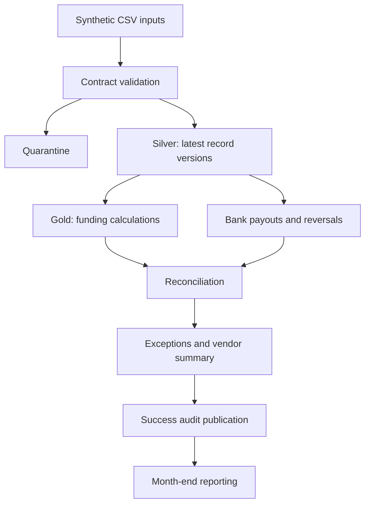

# Architecture

`src/retail_flow` contains shared business transformations and the local runner;
`dags` schedules processing without embedding financial logic; `databricks`
uses the same transformations on Azure; `infrastructure` packages runtimes;
`sql` contains reporting queries; `tests` verifies accounting and exception behavior.

Local storage has raw date batches, immutable run folders and a `CURRENT.json`
authoritative CURRENT_LEDGER publication pointer. Readers resolve this pointer, then read datasets
from its output root. Each snapshot includes every finalized partition through
its as-of date; joins match settlement keys across dates. Original accounting
dates and bank settlement dates remain distinct. A failed run leaves previous published results intact.
One root writer lock serializes generation, processing and retention. Reruns replace the logical
snapshot, retain earlier audit runs, and never append duplicates to a current report.

Databricks stores run-tagged Delta tables. The reporting view selects one latest SUCCEEDED historical as-of run. Publication is one Delta audit append;
individual dataset writes are separate transactions. This is deliberate rather
than a claim of a multi-table transaction. Configure one job writer per schema.
The job uses an existing UC enabled cluster; cloud resources are not provisioned
or charged by this repository.

CSV is the source contract. Parquet is the dependency-light local output; Delta
is an optional local output and the cloud table format. Native Spark expressions
avoid Python UDFs. Window functions choose current record versions. Joins use
record ID, vendor, date and currency; payout amounts aggregate before joining.
Quarantine retains original records and validation reasons. Every output has a
run ID and policy version; local manifests include source SHA-256 hashes.

This is a portfolio implementation with synthetic rules. No claim is made that
it has processed 50M records, met a production SLA, or saved real person-hours.
The four-hour job timeout is an operational constraint, not measured throughput.

Quality gates run before writes are published. Local ERROR/WARNING alerts are
persisted as JSON; cloud quality alerts use Delta records. Airflow failure
callbacks cover failed/timed-out tasks. Retention protects every referenced
success run, takes the shared lock, and defaults to a preview. Local freshness
checks evaluate the latest success timestamp. Raw history is always retained.

This implementation rebuilds historical snapshots for correctness and simple
recovery. Processing cost grows with retained raw history, and cumulative
snapshots consume more storage than an incremental ledger. Use the measured
benchmark tooling before choosing a production cluster or retention policy;
no production scale is inferred from the demo.
